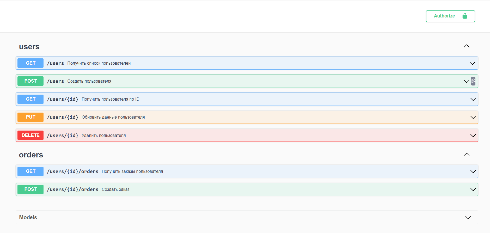

# KvantTZ - Управление пользователями и заказами

[](https://golang.org/)
[](https://gin-gonic.com/)
[](http://localhost:8080/swagger/index.html)

REST API для управления пользователями и их заказами с JWT-авторизацией и документацией Swagger.



## 📋 Требования
- Go 1.24+
- PostgreSQL 14+
- Docker 20.10+

## 🚀 Возможности
- Создание/удаление пользователей
- Управление заказами
- JWT-авторизация
- Пагинация и фильтрация
- Документация Swagger
- Логирование операций

## 🛠 Технологии
- **Backend**: Go 1.24
- **Фреймворк**: Gin
- **База данных**: PostgreSQL
- **ORM**: GORM
- **Документация**: Swagger
- **Контейнеризация**: Docker

## 🛠 Установка

### 1. Клонировать репозиторий
```bash

git clone https://github.com/ваш-логин/KvantTZ.git
cd KvantTZ
```

- Создайте `.env` файл в корне проекта:
- DB_HOST=postgres
- DB_PORT=5432
- DB_USER=postgres
- DB_PASSWORD=root
DB_NAME=user_orders
APP_PORT=8080
JWT_SECRET=your_strong_secret_key

### 2. Клонировать репозиторий
